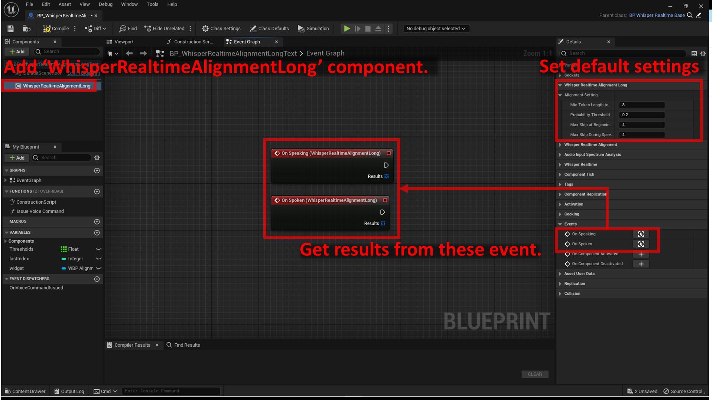
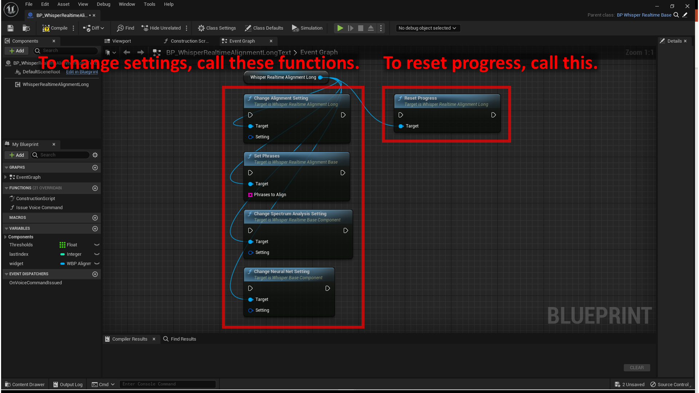

# Alignment for long phrases

See `Plugins > WhisperRealtime > Sample > BP > Alignment_Long > BP_WhisperRealtimeAlignmentLongText` for a sample implementation.
You can test it in sample map located at `Plugins > WhisperRealtime > Sample > Map > test_AlignmentLong`.

## Basic setup 

1. Create an actor blueprint.
2. Add `Whisper Realtime Alignment Long` component.
3. Set the default Neural Net settings:
	- See [How to use - Transcription](../how-to-use-transcript) page for the details.
4. Set the default alignment settings:
	- See [How to use - Alignment for short phrases](../how-to-use-alignment-short) page for the details.
5. Set the default alignment settings for long phrases:
	- Specify `Min Token Length to Search`, number of tokens to check if they have been spoken.
	- Specify `Probability Threshold`, a confidence threshold base for determining speech.
		
		??? Question "Formula"
			If b is this value and p is the probability of occurrence of each token when silence is input, then

			    (1 - p) * b + p
			
			is the final threshold value.

	- Specify `Max Skip at Beginning of Speech`, number of tokens below the threshold are allowed to be skipped at the start of a speech.
	- Specify `Max Skip during Speech`, number of tokens below the threshold are allowed to be skipped during a speech.

6. Get results from `On Speaking` event and `On Spoken` event.
	- These events provide an array of `Alignment Long Result`. The elements of the array hold the the following 3 propeties:
		- `Spoken history`: Substring of the phrase up to the point where it was spoken.
		- `Cursor`: Index of the first token that is not yet spoken.
		- `Probabilities`: Probability of each token in the phrase whether or not it was spoken.

	- See [How to use - Transcription](../how-to-use-transcript) page for the difference of `On Speaking` and `On Spoken` events.

	??? Question "How to check the tokens and thresholds for each phrase"
		Call `Get Alignment Targets` to get the array of `Whisper Alignment Long Target`.  
		Each element of this array contains information such as the token ID for each phrase.

{ loading=lazy }  

## Reset the progress

Call `Reset Progress` function to reset the progress of alignment for all phrases.

## Change settings

- To change Alignment settings, call `Change Alignment Setting` function.
- To change `Phrases to Align`, call `Set Phrases` function.
- To change Audio Input Spectrum Analysis settings, call `Change Spectrum Analysis Setting` function.
- To change Neural Net settings, call `Change Neural Net Setting` function.

{ loading=lazy }  
