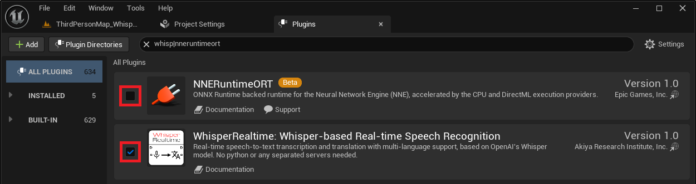

# インストール方法

1. [Fab](https://www.fab.com/listings/86ece157-4a33-4f84-b215-01e8dbf4d090)で購入し、インストールしてください。
2. Unreal Engine プロジェクトを作成します。
3. プロジェクトを開き、エディタメニューの `Edit > Plugins` を開き、

    - (UE5.5以降の場合) `NNERuntimeORT`を無効にします。

    - `WhisperRealtime: Whisper-based Real-time Speech Recognition` を有効にします。

    { loading=lazy }

4. プロジェクトを再起動します。

<!-- !!! Warning "Install to Linux"
    Since the Epic Games Launcher is not provided for Linux, you need to copy the plugin manually from Windows.
    
    1. On Windows, install the plugin from Epic Games Launcher.
    2. On Linux, create a project.
    3. Copy the plugin from the UE4 plugin folder on Windows to the project directory on Linux.
        - Copy from: <*UE4 installation folder on Windows*\>\Engine\Plugins\Marketplace\WhisperBasedRealtimeSpeechRecognition
        - Copy to: <*directory containing the .uporject created on Linux*>/Plugins/WhisperBasedRealtimeSpeechRecognition
    4. Recreate the following symbolic links:
        - WhisperBasedRealtimeSpeechRecognition/Source/ThirdParty/onnxruntime-linux-1.13.1/lib
            - libnvonnxparser.so
            - libnvonnxparser.so.8 -->
